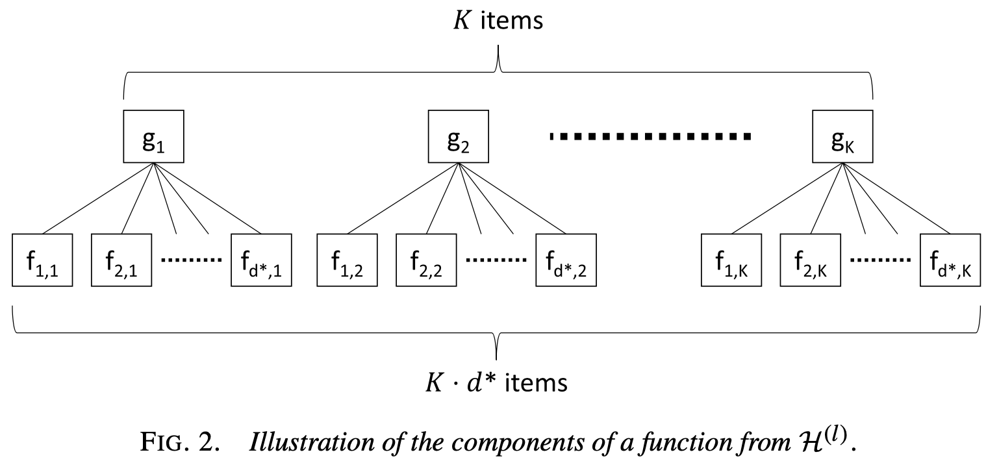
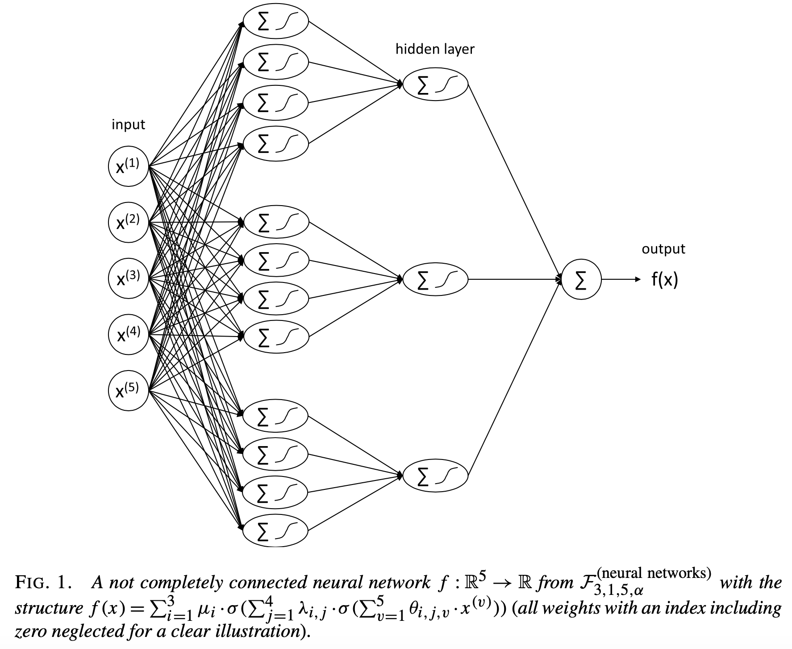
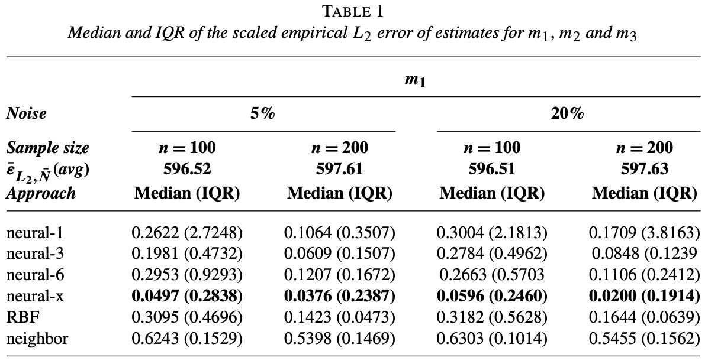
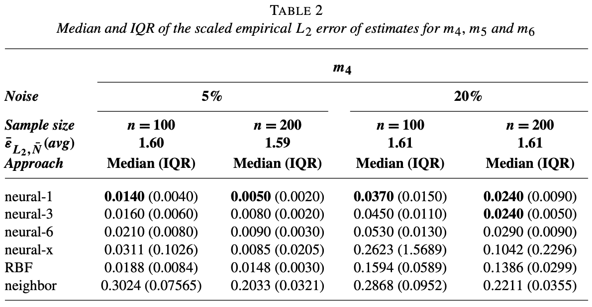
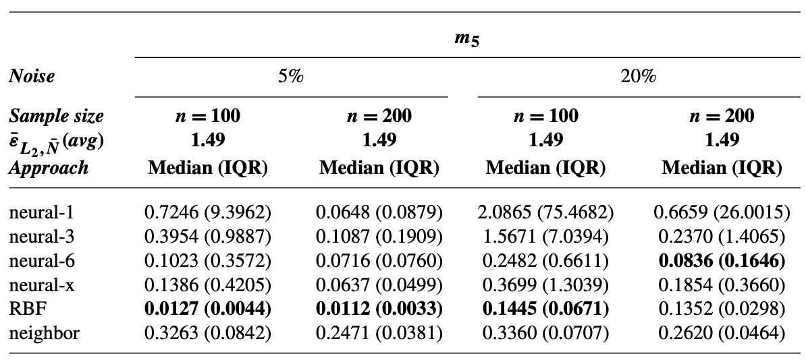
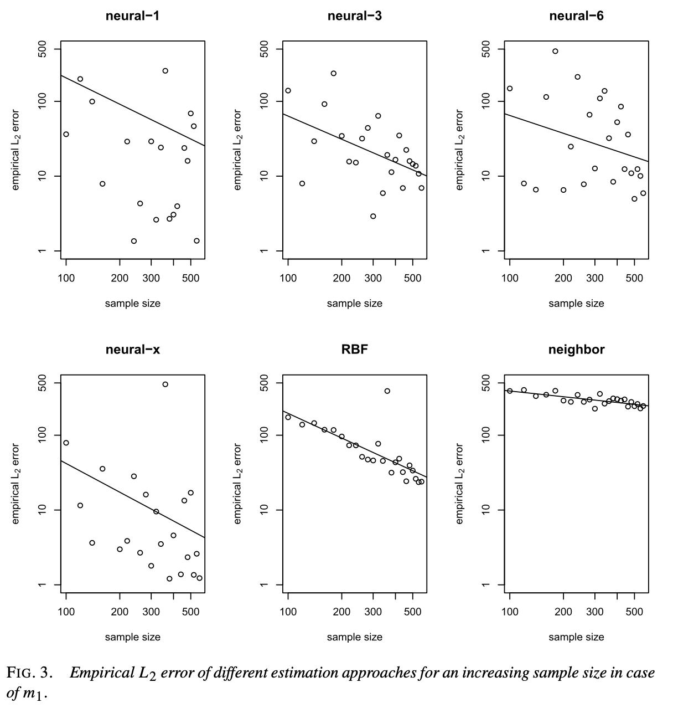

# Curse of Dimensionality

## Recap: Curse of Dimensionality

- Write a \textbf{one-dimensional} non-parametric model $$Y=g(X)+U, E[U|X]=0$$ 
- Main result: $$\int (\hat{g} (x)-g(x))^2 f_X(x) dx=O_p(K_n/n+K_n^{-2\alpha})$$
- In case of fastest rate of convergence, the variance and squared bias need to converge at the same rate. Then, $$\int (\hat{g} (x)-g(x))^2 f_X(x) dx=\fbox{$O_p(n^{-\frac{2\alpha}{1+2\alpha}})$}$$
- With more smoothness, i.e., higher $\alpha$, we have higher rate of convergence.

## Recap: Curse of Dimensionality
  - However, now write a \textbf{higher-dimensional} non-parametric model $$Y=g(X^{(1)},X^{(2)},\ldots, X^{(d)})+U, E[U|X]=0$$ 
  - Then, the mean square rate of convergence is $$O_p(K_n^d/n+K_n^{-2\alpha})$$. 
  - By following similar arguments as before, $K_n \asymp n^{\frac{1}{d+2\alpha}}$ in case of fastest rate of convergence. Then, mean square rate of convergence becomes $$\fbox{$O_p(n^{-\frac{2\alpha}{d+2\alpha}})$}$$
  - Here comes the problem of \textbf{curse of dimensionality}
  
# Main result of paper

## Additive and Interaction Model
  - Stone (1985) assumes an \textcolor{blue}{additivity condition}:
  $$m(X^{(1)},X^{(2)},\cdots,X^{(d)})=m_1(X^{(1)})+\cdots+m_d(X^{(d)})$$
  Now, the optimal rate of convergence of additive model is \fbox{$O_p(n^{-\frac{2p}{1+2p}})$}.
  - Stone (1994) generalized this to \textcolor{blue}{interaction model}. Suppose for some $d^* \in \{1,\ldots,d\}$, the model is:
  $$m(X)=\sum_{I \subseteq \{1,\ldots,d\}, |I|=d^*} m_I(X_I)$$
  where $X=(X^{(1)},\ldots,X^{(d)})^T \in \mathbb{R}^d$, all $m_I$ are smooth functions defined on $\mathbb{R}^{|I|}$ and for $I=\{i_1,\cdots,i_{d^*}\}$ with $1\le i_1 \le \cdots \le i_{d^*} \le d$, the abbreviation $X_I=(X^{(i_1)},\cdots,X^{(i_{d^*})})^T$ is used. \\
  Now, the optimal convergence rate of interaction model is \fbox{$O_p(n^{-\frac{2p}{d^*+2p}})$}.
  
## Single Index Models and Projection Pursuit
  - \textcolor{blue}{Single index model}: $$m(X)=g(a^T X), (X \in \mathbb{R}^d)$$
  where $g: \mathbb{R} \rightarrow \mathbb{R}$ and $a \in \mathbb{R}^d$.
  - Single index model is extended to so called \textcolor{blue}{projection pursuit}:
  $$m(X)=\sum_{k=1}^K g_k(a_k^T X), (X \in \mathbb{R}^d)$$
  where $K \in \mathbb{N}$, $g_k: \mathbb{R} \rightarrow \mathbb{R}$ and $a_k \in \mathbb{R}^d$. 
  - Horowitz and Mammen (2007) further studies the \textcolor{blue}{following mode} (simplified):
  $$m(X)=F(m_1(X^{1})+\cdots+m_d(X^{(d)}))+U$$
  - A univariate rates of convergence, i.e., \fbox{$O_p(n^{-\frac{2p}{1+2p}})$} has been proved for above three models, up to some logarithmic factor.
  
## Generalized Hierarchical Interaction Model

- \textcolor{blue}{Motivation}: Applications in complex technical system, which are constructed in modular form. \textcolor{blue}{Each modulars depends only on a few of the components of a high-dimensional input.}

- Let $d\in \mathbb{N}$, $d^* \in \{1,\cdots,d\}$ and $m: \mathbb{R}^d \rightarrow \mathbb{R}$
  1. $m$ is a gerneralized hierarchical interaction model of order $d^*$ and level 0, if $\exists \quad a_1,\cdots,a_{d^*} \in \mathbb{R}^d$ and for $f:\mathbb{R}^{d^*} \rightarrow \mathbb{R}$, s.t. for all $X \in \mathbb{R}^d$, $$m(X)=f(a_1^TX,\cdots,a_{d^*}^TX)$$
  2. $m$ is a gerneralized hierarchical interaction model of order $d^*$ and level $l+1$, if $\exists \quad K\in \mathbb{N}$, $g_k:\mathbb{R}^{d^*} \rightarrow \mathbb{R}(k=1,\cdots,K)$ and $f_{1,k},\cdots,f_{d^*,k}: \mathbb{R}^d \rightarrow \mathbb{R} (k=1,\cdots,K)$, s.t. $f_{1,k},\cdots,f_{d^*,k} (k=1,\cdots,K)$ satisfy a generalized hierarchical interation model of order $d^*$ and level $l$,for all $X \in \mathbb{R}^d$,:$$m(X)=\sum_{k=1}^{K}g_k(f_{1,k}(X),\cdots,f_{d^*,k}(X))$$

## Generalized Hierarchical Interaction Model (Example)
{width=350px}

## Multilayer Feedforward Neural Networks

- \textcolor{blue}{Single hidden layer neural network}: 
  1. Barron(1994): $L_2$ error has a dimensionless rate of \fbox{$n^{-1/2}$} (up to some logarithmic factor), provided the Fourier transform has a finite first moment.
  2. McCaffrey and Gallant(1994): $L_2$ error has a rate of \fbox{$n^{-\frac{2p}{2p+d+5}+\epsilon}$} for a suitably defined single hidden layer neural network estimate for $(p,C)$-smooth functions.
  
- \textcolor{blue}{Two and multi-layer neural network}:
  1. Kohler and Krzyżak (2005): Suitable two layer nn estimates achieve a rate of convergence of \fbox{$n^{-\frac{2p}{2p+d^*}}$} (up to some logarithmic factor) for $(p,C)$-smooth interaction models with \fbox{$p \le 1$}.
  2. Kohler and Krzyżak (2017): Suitable defined multilayer nn estimates achieve a rate of convergence of \fbox{$n^{-\frac{2p}{2p+d^*}}$} (up to some logarithmic factor) for $(p,C)$-smooth interaction models with \fbox{$p \le 1$}.

## Multilayer Feedforward Neural Networks

- \textcolor{blue}{Bauer and Kohler (2019)}: $L_2$ errors of least squares nn estimates achieve the rate of convergence \fbox{$n^{-\frac{2p}{2p+d^*}}$} (up to some logarithmic factor) for $(p,C)$-smooth generalized hierarchical interaction model of given order $d^*$ and given level $l$. Here, \fbox{$p >0$} might be arbitrarily large.
- Similar rates have been obtained in the literature. \textcolor{blue}{However}, they have much more stringent assumptions on the functional class the regression function belongs to. 
- To achieve the above-mentioned rate, completely new approximation results for \textcolor{blue}{sparse neural networks with several hidden layers} were needed.
  
## Sparse Multilayer Feedforward Neural Networks

- For $M^* \in \mathbb{N}$, $d \in \mathbb{N}$, $d^* \in \{1,\ldots, d\}$ and $\alpha >0$, we denote the set of all functions $f: \mathbb{R}^d \rightarrow \mathbb{R}$ that satisfy:
$$f(X) = \sum_{i=1}^{M^*}\mu_i \cdot \sigma \left( \sum_{j=1}^{4d^*} \lambda_{i,j}\cdot \sigma\left(\sum_{v=1}^{d} \theta_{i,j,v}\cdot X^{(v)} +\theta_{i,j,0}\right) +\lambda_{i,0} \right)+\mu_0$$
$X \in \mathbb{R}^d$ for some $\mu_{i}$, $\lambda_{i,j}$ and $\theta_{i,j,v} \in \mathbb{R}$, where $|\mu_i|\le\alpha$, $|\lambda_{i,j}|\le\alpha$ and $|\theta_{i,j,v}|\le\alpha$ for all $i \in \{0,1,\ldots, M^*\}$, $i \in \{0,\ldots,4d^*\}$, $v \in \{0,\ldots,d\}$, by \fbox{$\mathcal{F}_{M^*,d^*,d,\alpha}^{(\textsf{neural networks})}$}.

- The neural network has only $W(\mathcal{F}_{M^*,d^*,d,\alpha}^{(\textsf{neural networks})})$ weights.
\begin{align*}
W(\mathcal{F}_{M^*,d^*,d,\alpha}^{(\textsf{neural networks})})
  &=& M^*+1+M^* (4d^*+1)+M^* 4d^* (d+1) \\ 
  &=& M^* (4d^* (d+2)+2)+1
\end{align*}

## Sparse Multilayer Feedforward Neural Network

{width=330px}

## Hierarchical Neural Networks

- For $l=0$,we define our space of hierarchical neural networks by $$\mathcal{H}^{(0)}=\mathcal{F}_{M^*,d^*,d,\alpha}^{(\textsf{neural networks})}$$
- For $l>0$, we define recursively 
$$
\mathcal{H}^{(l)}=\left\{h:\mathbb{R}^d \rightarrow \mathbb{R}: h(X)=\sum_{k=1}^K g_k(f_{1,k}(X),\ldots,f_{d^*,k}(X))\right\}
$$
for some $g_k \in \mathcal{F}_{M^*,d^*,d^*,\alpha}^{(\textsf{neural networks})}$ and $f_{j,k} \in \mathcal{H}^{(l-1)}$
- \textcolor{blue}{Theorem}: With $M^*=\lceil c_{56} \cdot n^{\frac{d^*}{2p+d^*}} \rceil$ and some other assumptions,  $$\mathbf{E}\int|m_n(x)-m(x)|^2\mathbf{P}_X(dx)\le \fbox{$c_4 \cdot log(n)^3 \cdot n^{-\frac{2p}{2p+d^*}}$}$$ holds for sufficiently large n.

## Hierarchical Neural Networks (Example)

{width=350px}

# Simulations

## Settings

- Alternative approaches: 
  1. Simple Nearest Neighbor Estimate (\textit{neighbor})
  2. Interpolation with radical basis functions (\textit{RBF})
  3. Fully connected neural networks with predefined numbers of layers but adaptively chosen numbers of neurons per layer (\textit{neural-1}, \textit{neural-3}, \textit{neural-6})

- Model functions: 
  1. $m_1$ represents some ordinary general hierarchical interaction models
  2. $m_4$ is an additive model with $d^*=1$
  3. $m_5$ is an interaction model with $d^*=d$

- Data generation: 
$$Y=m_i(X)+\sigma_i \cdot \lambda_i \cdot \epsilon$$
where $i \in \{1,2,3,4,5,6\}$ and $j \in \{1,2\}$.  X is uniformly distributed on $[0,1]^d$ and $\epsilon$ is standard normally distributed and independent of $X$. $\sigma_i$ and $\lambda_i$ are predetermined.

## Results

{width=450px}

## Results

{width=450px}

## Results

{width=450px}

## Results

{width=350px}

# Vielen Dank!  ;)

